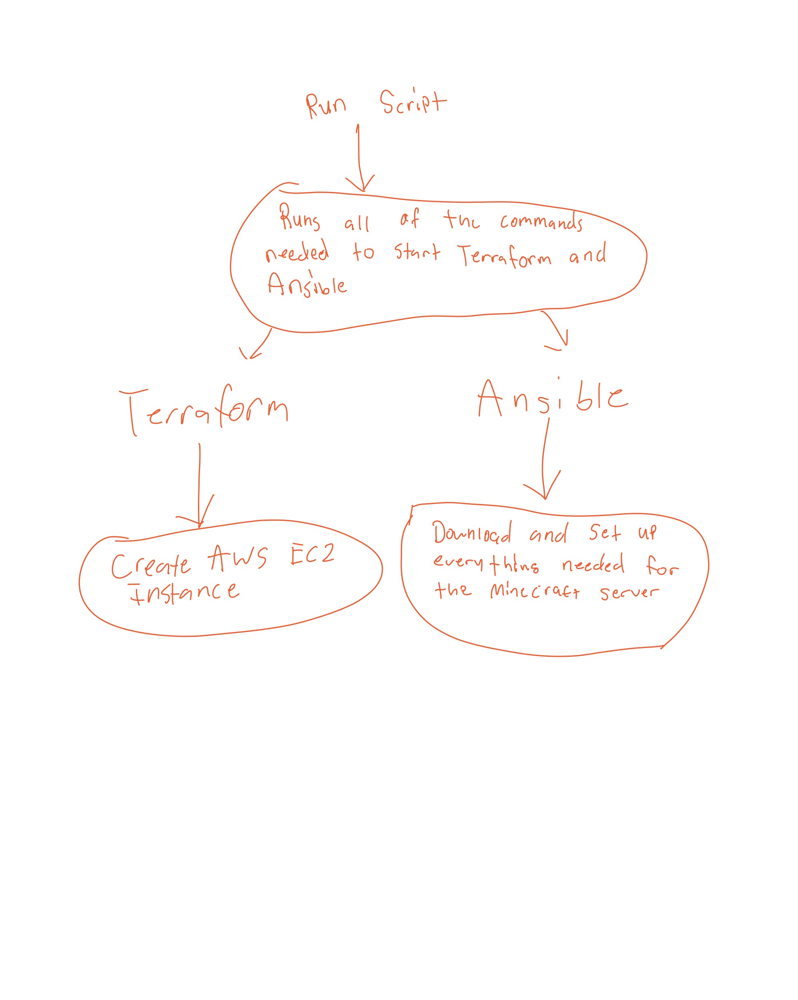

# MinecraftServerAutomation
Creating infrastructure provisioning scripts to automate a Minecraft server creation and deployment.

## Tutorial

### Background

We will be fully automating the creation and deployment of a Minecraft server. We will do this by using software tools like Terraform and Ansible to create scripts and run them to set everything up for us.

### Requirements

In order to create and run the scripts, there are a few things you'll need to configure first.

#### Install AWS CLI

To install the AWS CLI, visit [this website](https://docs.aws.amazon.com/cli/latest/userguide/getting-started-install.html) and follow the instructions for your respective operating system.

#### Install Terraform

To install Terraform, visit [this website](https://developer.hashicorp.com/terraform/tutorials/aws-get-started/install-cli) and follow the instructions for your respective operating system.

#### Install Ansible

To install Ansible, visit [this website](https://docs.ansible.com/ansible/latest/installation_guide/intro_installation.html) and follow the instructions for your respective operating system.
 
#### Set AWS Credentials

The last thing you'll need to do to get set up is find your AWS credentials and set them using the command ```aws configure set <name_of_var> "<value>"```. To find the credentials that you need, open up your AWS Academy Learner Lab. Click on the "AWS Details" button in the top right corner. then use the command listed above to set each variable. There should be 3 in total (key, secret, and token).

Once you follow these steps, you should be ready to begin creating the scripts.

#### Diagram of Pipeline

Here is a diagram depicting the flow of the scripts that we'll be using:


#### Terraform script

1. First, create a new directory for the Terraform files called 'terraform' and enter it.
2. Create a new file: ```main.tf``` and paste in the code from [the repo](https://github.com/niclbody13/MinecraftServerAutomation/blob/main/terraform/main.tf).
3. Create another file: ```variables.tf``` and paste in the code from [the repo](https://github.com/niclbody13/MinecraftServerAutomation/blob/main/terraform/variables.tf).
4. Create another file: ```outputs.tf``` and paste in the code from [the repo](https://github.com/niclbody13/MinecraftServerAutomation/blob/main/terraform/outputs.tf).
5. Now, run the following commands:
```terraform init``` - this will initialize the directory
```terraform fmt``` - this will format your files
```terraform validate``` - this will make sure that all of your files are valid
6. You should now be set up with the Terraform script.

#### Ansible script

1. Exit the terraform directory and make a new one called 'ansible'.
2. Create a new file: ```minecraft.yml``` and paste in the code from [the repo](https://github.com/niclbody13/MinecraftServerAutomation/blob/main/ansible/minecraft.yml).
3. Create another file: ```inventory.ini``` and past in the code from [the repo](https://github.com/niclbody13/MinecraftServerAutomation/blob/main/ansible/inventory.ini).
4. You should now be set up with the Ansible script.

#### Run script

Now we will create the run script that will run our other scripts for us.

1. Go to the parent directory and create a new file: ```run.sh``` and paste in the code from [the repo](https://github.com/niclbody13/MinecraftServerAutomation/blob/main/run.sh)
2. You should now be ready to deploy your server!

#### Deploying the server

To deploy the server, simply run ```./run.sh``` and watch the magic happen!

#### Connecting to the Minecraft server

To connect to your Minecraft server, first open up a Minecraft client running version 1.20.1. Then click on Multiplayer -> Add Server. Name the server and then enter the IP address of your instance which should be listed in your terminal. Click done and you should be ready to mine!